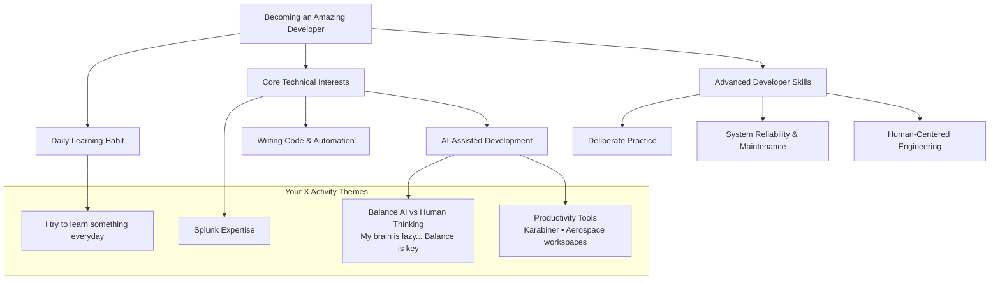

# Knowledge Graph: My Learning Journey

This is a living knowledge graph built from my public X activity, developer interests, and daily learning habits. Open this note in Obsidian → Graph View for the full interconnected map.

## Mermaid Knowledge Graph

## Obsidian Wiki Links (for automatic graph connections)
- [[Notes/Interests/Becoming-an-Amazing-Developer]]
- [[Notes/Splunk]]
- [[Notes/Automation-with-AI]]
- [[Notes/Productivity-Tools]]

## Next steps
Tell me what to expand next (e.g. "add a node for Ham Radio", "create the Splunk note", etc.) and I’ll push the new connected files instantly.

_Last updated: 2026-05-13_